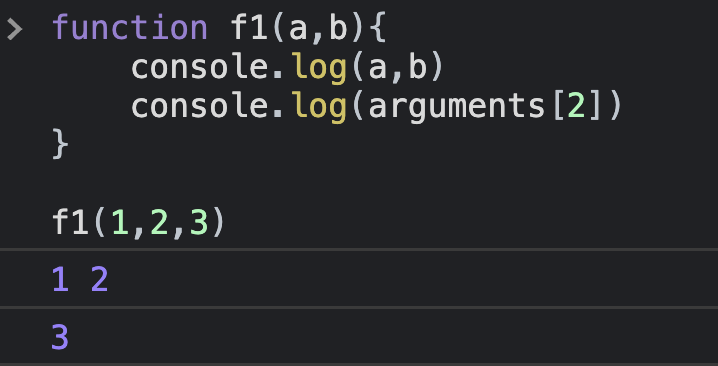

# ✈️ Function

1. 매개변수는 함수 내의 지역 변수가 됨 - 함수 외부에서는 사용할 수 없음

2. 매개변수에 하나의 데이터를 저장하는 기본형 데이터를 대입하면 함수 내에서 데이터를 변경해도 원본에는 아무런 영향이 없고(이것을 예전에는 CALL BY VALUE 라고 함)

3. 0개 이상의 데이터를 가진 배열이나 객체를 대입한 경우 함수 내에서 배열이나 객체의 내부 요소를 변경하면 원본의 내용도 변경된다.(이것을 예전에는 CALL BY REFERENCE라고 함)

4. arguments 배열
함수 내의 만들어진 숨겨진 변수로 매개변수에 데이터를 대입하면 순서대로 저장하고 있는 배열이다.

5. JavaScript에서는 매개변수 개수보다 더 많은 양의 데이터를 대입하면 매개변수 개수만큼 매개변수에 대입하고 나머지 arguments 배열에서 찾아서 사용할 수 있다.

6. 매개변수 개수보다 적게 대입하면 앞에서부터 순서대로 채워지고 나머지는 undefined 가 된다.

7. pure function(순수 함수) 
   => 동일한 입력에 동일한 출력을 만들어야 한다. 
   => 외부 데이터를 변경하지 않아야 한다. 
   => 결과는 리턴을 해야한다.

8. 재귀함수(Recursion) 
   => 함수가 자기 자신의 함수를 리턴하는 경우 
   => 재귀를 사용하면 코드의 가독성이 높아지는 메모리 사용량이 많아지고 시간이 오래 걸릴 수 있다.  
   => 재귀를 만들 때는 반드시 종료하는 지점이 있어야 한다.

9. JavaScript에서는 함수가 일급 객체  
   => 함수도 하나의 자료형 
   => 함수도 하나의 자료형이므로 변수에 대입할 수 있고 매개변수로도 사용할 수 있고 return 할 수도 있음  
   🔥 일급객체(First-class Object)란 다른 객체들에 일반적으로 적용 가능한 연산을 모두 지원하는 객체를 가리킨다. 

10. Callback 함수 
    => 이벤트나 상태 변화가 발생하면 호출되는 함수 
    => 함수의 매개변수로 함수를 대입받는 형태로 많이 구현

11. Nested 함수 
    => 함수 안에 함수를 만드는 것이 가능
    
12. High Order Function 
    => 다른 함수를 리턴하는 함수로 currying 이라고도 하면 디자인 패턴으로 간주하기도 함

13. Closure 
    함수 안에서 함수를 리턴해서 함수 외부에서 함수 내부의 데이터를 수정하는 것

14. 함수의 매개변수에 기본값 설정이 가능 
    =>매개변수 이름 뒤에 = 와 함께 값을 설정하면 됨

15. 화살표 함수 
    =>ECMA 2015에 추가된 문법 
    =>함수를 아래처럼 작성 
    (매개변수 나열) => {함수의 내용} 
    =>매개변수가 1개이면 ( )를 생략해도 됩니다. 
    =>함수의 내용이 한 줄 이면 { } 생략 가능 
    =>마지막 수행되는 문장의 결과를 return 
    =>함수 내부에서 this 와 arguments를 사용할 수 없음 
    arguments 대신에 rest를 사용 
    => => 앞에서 줄 바꿈하면 에러이고 뒤에서 하는 것은 관계없음 
    =>콜백 함수로 설정할 때 주로 이용

16. Built In(내장) 함수 
    => JavaScript에서 제공하는 함수로 실제로는 window 객체의 메서드인데 window 객체를 이용해서 내부 요소를 호출할 때는 window.을 생략할 수 있어서 전역 함수처럼 사용한다.

17. alert 
    => 메시지를 대화상자에 출력할 때 사용되는 함수 
    alert(메시지) 형태로 사용하는데 return 되는 데이터가 없음